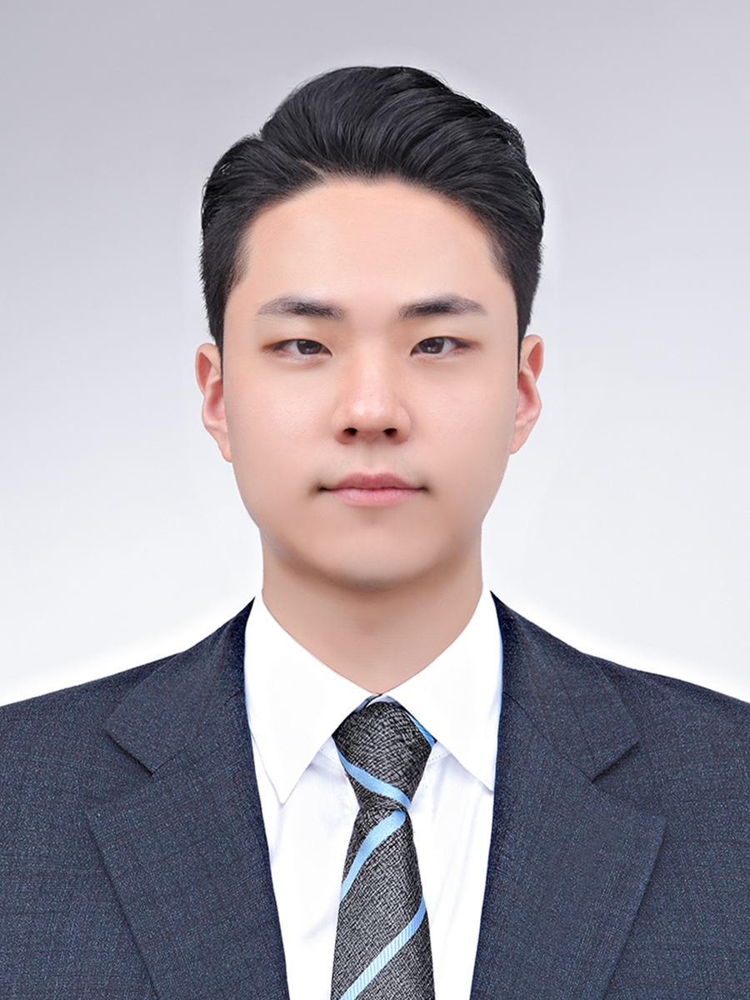

# Portfolio Website

  

배움과 실행으로 성장하는 김서준입니다.

---

## About

- 경희대학교 사학과

- 운영 및 콘텐츠 기반 활동 경험

- 디지털 도구 및 AI 활용에 관심

- 웹 기반 포트폴리오 직접 제작 및 배포

---

## Skills

### Digital Tools

- Excel
- PowerPoint
- Photoshop
- Figma

### Web

- HTML
- CSS
- JavaScript

### Others

- AI 기반 문서 및 콘텐츠 활용 경험
- GitHub Pages 배포 경험

---

## Experiences

### Kings Gambit Chess Club

- 동아리 운영 및 행사 진행 지원
- 일정 관리 및 대회 운영 참여

### Supporters & Festival Activities

- 청정원 대학생 봉사단
- 익산 서동축제 서포터즈
- 콘텐츠 제작 및 행사 운영 경험

### Front-End Bootcamp

- 프론트엔드 교육과정 수료
- 팀 프로젝트 및 결과물 제작 경험

---

## Certifications

- [TOEIC](chatgpt://generic-entity?number=0)
- [컴퓨터활용능력 2급](chatgpt://generic-entity?number=1)
- [GTQ](chatgpt://generic-entity?number=2)
- [JLPT N5](chatgpt://generic-entity?number=3)

---

## Awards

- 프론트엔드 프로젝트 대상
- 교내·교외 활동 수상 경험

---

## Contact

- Email : rock0113@khu.ac.kr
